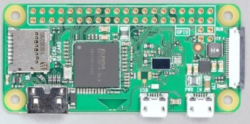
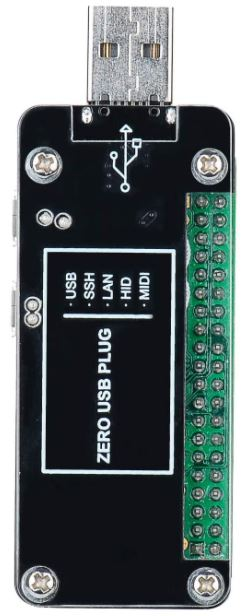
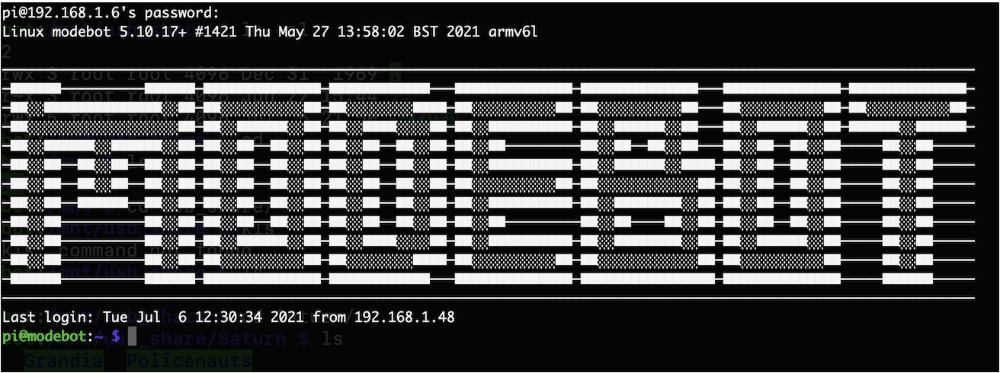
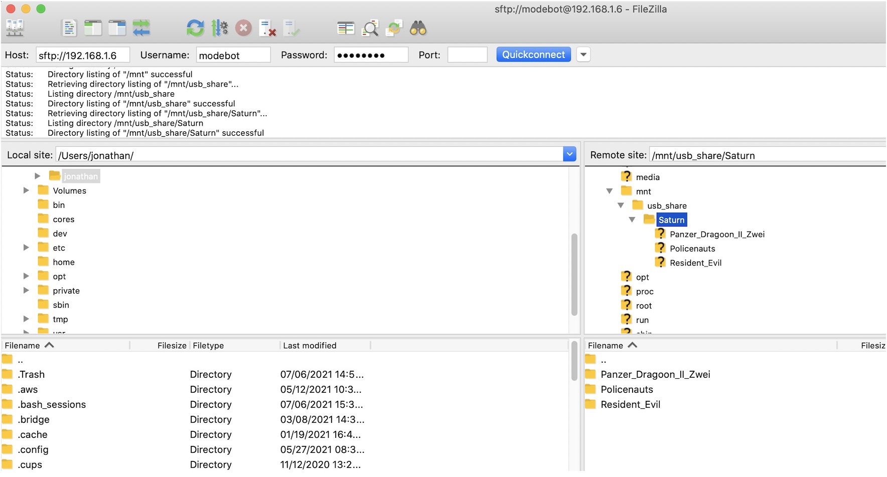
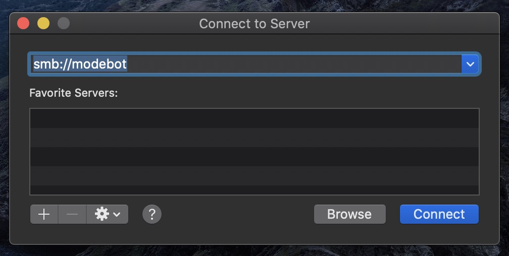
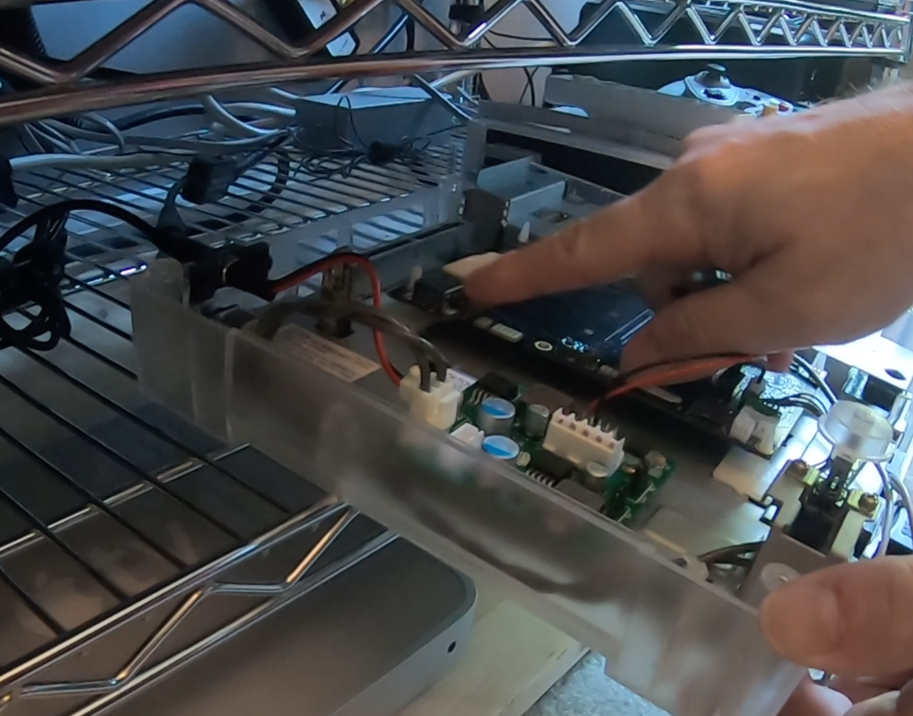
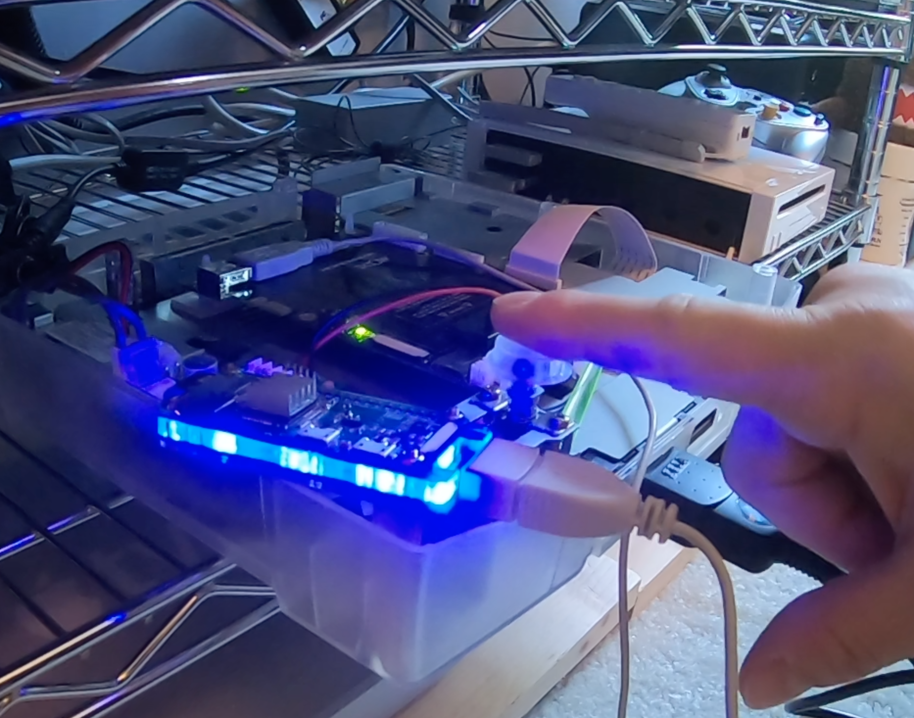
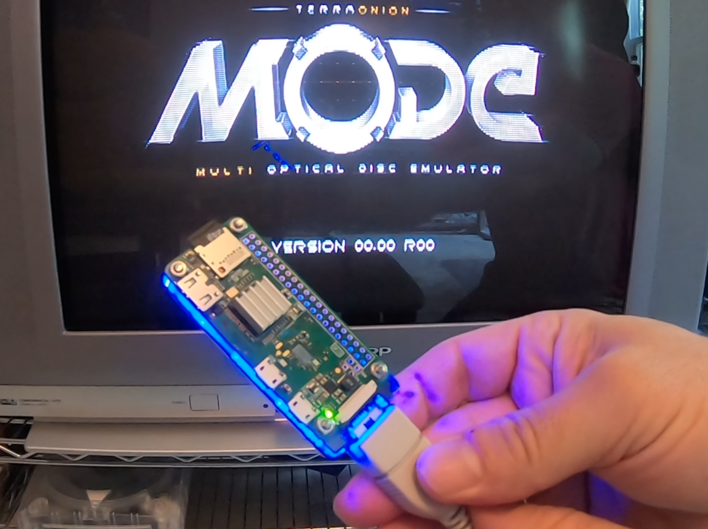
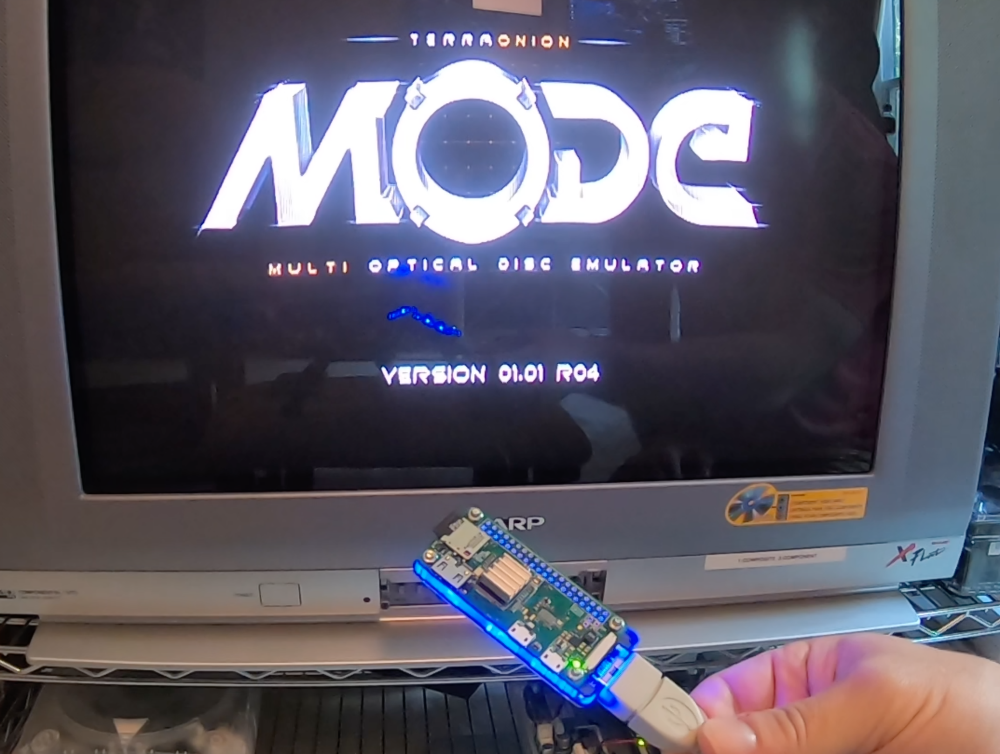

# MODEbot

Load images to a Terraonion MODE over the network.

Attribution: Russell Barnes - Magpi - https://magpi.raspberrypi.org/articles/pi-zero-w-smart-usb-flash-drive

## Materials needed

**Raspberry Pi Zero W**



The Modebot uses a Raspberry PI Zero W since it is small, low power, and does not need any sort of fans or cooling. They are also widley available and relativly inexpensive.

[PI Zero](https://www.raspberrypi.org/products/raspberry-pi-zero-w/)

**SD Card**

If you have never used a PI before, you will need a MicroSD card to run the OS from and to store your games on. A larger card with the fastest transfer rate is suggested, however any card should work.

[Card Types](https://kb.sandisk.com/app/answers/detail/a_id/2520/~/sd/sdhc/sdxc-specifications-and-compatibility)

Here are a couple of examples.

[256GB](https://www.amazon.com/Samsung-Electronics-microSDXC-Adapter-MB-ME256HA/dp/B0887P21Z2/ref=sr_1_3?dchild=1&keywords=microSD&qid=1625587489&refinements=p_n_feature_two_browse-bin%3A13203835011&rnid=6518301011&s=pc&sr=1-3)

[128GB](https://www.amazon.com/SanDisk-128GB-Extreme-microSD-Adapter/dp/B07FCMKK5X/ref=sr_1_4?dchild=1&keywords=microSD&qid=1625587590&sr=8-4)

**Flash Utility**

There are several SD card flashing utilities you can use. The two popular flash utilites are Etcher, and 

[Etcher](https://etcher.download/download-etcher/)

[PI Imager](https://www.raspberrypi.org/software/)

**USB Dongle Module**



The Terraonion MODE accepts a USB stick as one of the supported storage types. However, you can not use the USB storage with an SSD installed on the MODE.

To make the install more natural, and allow you to fit the MODEbot in the console case, a USB dongle adaper is suggested. The dongle also adds a finished touch to the project.

Here is a link to the iUniker USB Dongle adapter.

[USB Dongle](https://www.amazon.com/iUniker-Expansion-Breakout-Raspberry-Inserted/dp/B07NKNBZYG)

**USB Cable**

In the absence of a USB adapter a USB cable can be used. However you will need to make sure that you plug the cable into the second MicroUSB port, since the first port is for *power only*. 

**MODE Installed**

The most obvious part is to have the MODE properly installed in your console, tested and functional. The MODE install is outside of the scope of this project, however the Terraonion team has put together a comprehnsive
set of instructions that make the install very straight forward.

*NOTE:* When you set up your MODE, make sure the reset behavior is set to "boot to menu"

[MODE](https://terraonion.com/en/producto/terraonion-mode/)

## Setup MODEbot.

Installing and setting up Raspberry PI OS is outside of the scope of this project, the Raspberry PI foundation has a very useful walkthourgh using the Pi Imager.

[OS Install](https://www.raspberrypi.org/documentation/installation/installing-images/)

### OS

MODEbot has been built and tested on a Raspberry PI Zero W, running Raspberry PI os Buster(Raspbian10).

### Network

You will need to make sure that your wifi network is functional in order to connect to the MODEbot over the network.

### Login

Use the default Raspberry PI OS credentials if you have not already changed them.

username: pi

pass:raspberry

CAUTION: You should change the password on the first login if you have not already done so. This account allows sudo access.

### Install Git

Use Git to pull this repository down to the MODEbot. Once pulled you will be able run the setup script.

```
# apt install git
```

### Run Setup

```
# cd modebot
```

Edit the defaults. The default set in the script is 4GB in megabytes.

USB Disk size: DISKSIZE='4096'

Modebot password: PASS='password'

Pi user password: ADMINPASS='modebot1!*'

```
# sudo ./setup.sh
```

When the install is done, reboot your MODEbot and use SSH to connect to make sure you can connect to it.



The *modebot* user account should be used to login and add new images to the modebot.

## Add images to the MODEbot

There are two ways to add images on to the MODEbot. The images can be added before you plug it into the MODE, or after, via sftp or SMB.

### Setup

The storage needs to have a specific file hirarchy in order to work with MODE.

As an example on Sega Saturn

```
Satun
    |_MYGAMEFOLDER
       |_MYGAME.bin
       |_MYGAME.cue
       |_MYGANE.iso
```

### SFTP

SFTP can be used to transfer your game images to the MODEbot.



### SMB

The MODEbot storage partition can be mounted via SMB like any other network share and copy your bin,cue or iso images to the drive.

The MODEbot should autorefresh, and the games will show up in the list when you go to the MODE game list if the directory structure is correct.



## Operation

*NOTE:* A Sega Saturn is used in this example, the Sony Playstation and Sega Dreamcast should work the same but have not been tested.

In order to use the MODEbot, connect the USB Dongle to the USB port on the MODE and turn on the console. The MODE will supply all power to the MODEbot.



Once the console is powered up, you will see the green led on the PI Zero flashing as it boots up.



Once the console is booted, and the green led on the PI Zero stops flashing, press the console reset button.



Since the MODEbot takes a couple of seconds to make the storage available, it may not be ready for the MODE to detect. Pressing the reset button allows
the MODE and MODEbot to stay powered up, but for the console and MODE to reread the storage.



At this point you should see your game list. If you add new games to the MODEbot, simply press reset and they will appear in the games list.
